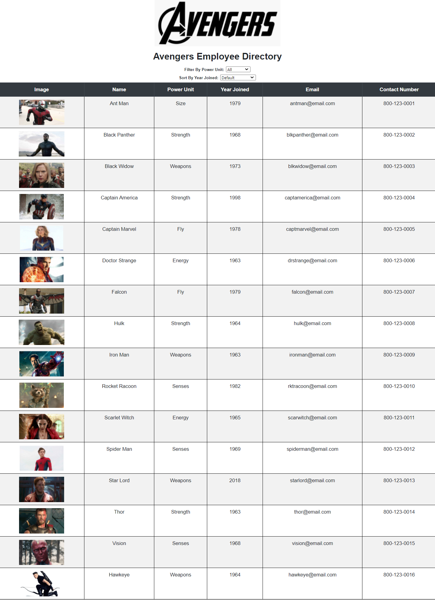
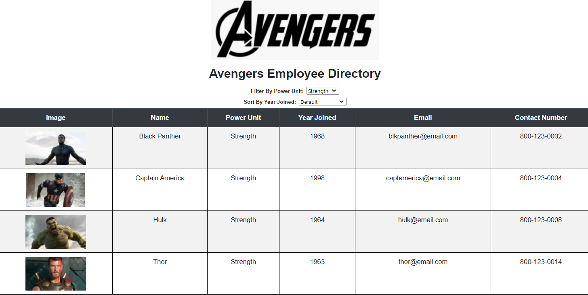

# 19-Employee Directory
____
## Objective
Create an employee directory with React, and break up the application's UI into components; manage component state; and respond to user events.
____
## Table of Contents
* [User_Story](#user_story)
* [Installation](#installation)
* [Usage](#usage)
* [License](#license)
* [Contributing](#contributing)
* [Questions](#questions)
* [Application_Links_and_Images](#application_links_and_images)
## User_Story:
As a user, I want to be able to view my entire employee directory at once so that I have quick access to their information.
____
## Installation
(1) Go to the `src` folder in VS Code, right-click, select **Open in Integrated Terminal** and type: **npm i** (install) to install all required dependencies for the app, creating the **node modules** folder and **package-lock.json** file   
(2) Type **npm start** to invoke the app     
(3) The App will automatically open a webpage on **localhost:3000** displaying the **Avengers Employee Directory**   
_____
## Usage
This app shows how an employee or manager could benefit greatly from being able to view non-sensitive data about other employees. It would be particularly helpful to be able to filter employees by tenure, and specific personal strengths or abilities.  A group of random Avengers (a fictional team of superheroes created by Marvel comics) was selected to build this app.  The employee or manager has the ability to:   
- Sort the Avengers directory per the length of time since each character was created by Marvel comics (from longest tenure to shortest tenure, or vice versa)
- Filter the Avengers directory per their individual Power Unit (Energy, Fly, Senses, Size, Strength, or Weapons)   
- The Directory can be re-set to the original display by sorting per **Default**, and Filter per **All**, and re-freshing the page    
_____
## Contributing
ed-sivick, Stack Overflow, Grepper, and BCS support for functionality and code syntax
_____
## Questions
If there are any questions, or if you would prefer more information concerning this app,
please contact the following person at their GitHub profile or email address below:

* [GitHub Profile](https://github.com/ed-sivick)
* ed@sivick.net
_____
## License
You can view more information concerning software licenses at the following link:

* [License](https://opensource.org/licenses/MIT)
_____
## Badges

_____
## Application_Links_and_Images  
**Links:**  
Heroku link: (https://placeholder.com/)

**Application Image Examples:** 

<strong>Image of Avenger Employee Directory</strong>

  
  
 
  
  
<strong>Image of Avenger Employee Directory Filtered by Strength Power Unit</strong>

  
  
 